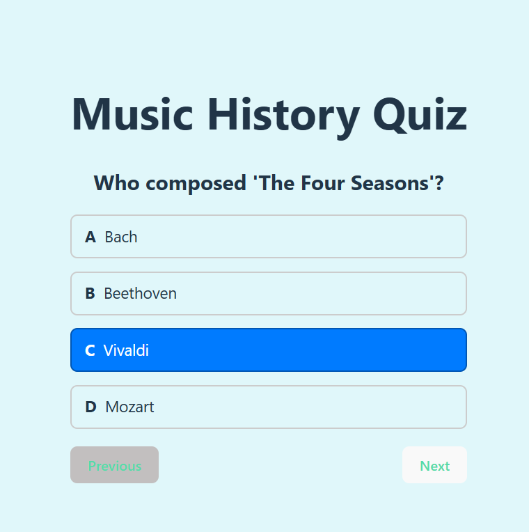
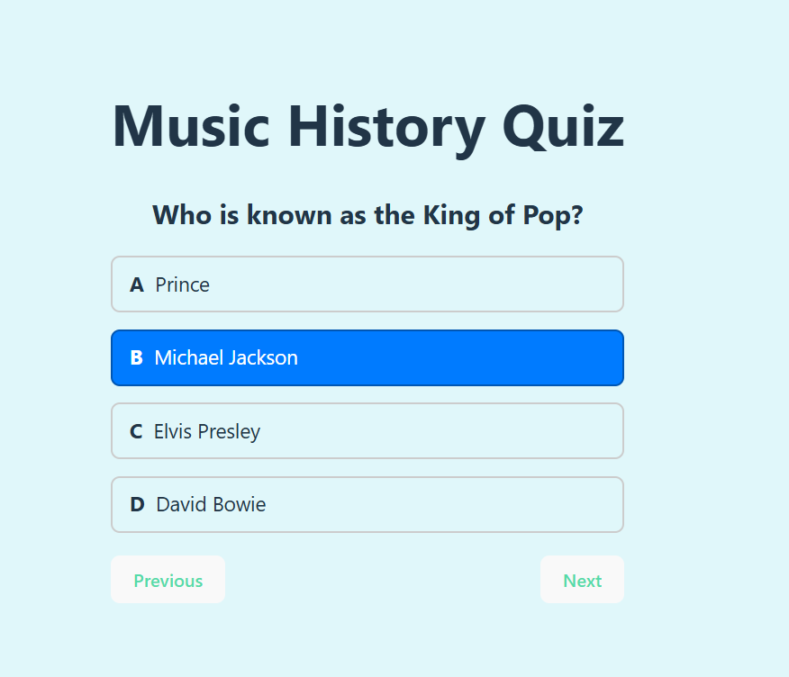
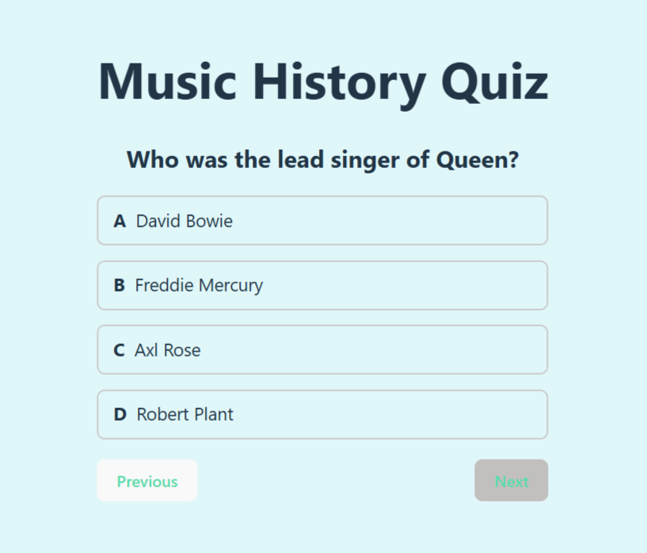
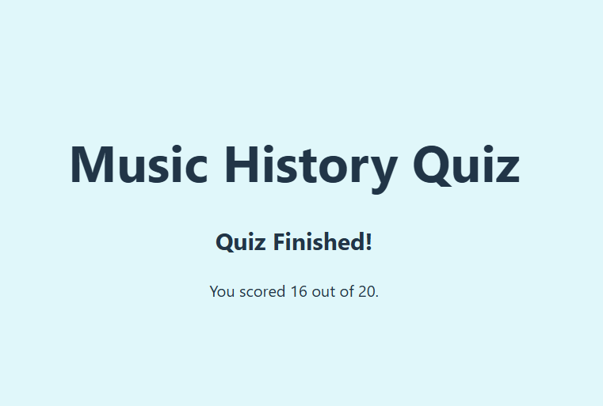

# React Trivia 🎵

Created September 9, 2024 by: @LydiasPianoStudio Lydia Bandy

## Overview

React Trivia is a web application built using React, TypeScript, and Vite. The application provides a trivia game experience where users can answer various trivia questions. This trivia app is specifically designed based on music trivia for students and musicians to enjoy, making learning about music both fun and engaging. There are 20 questions with a score board at the end! 🎵 What is your score? Give it a try!

## Skills and Technologies Used

### Programming Languages

- TypeScript
- JavaScript

### Frameworks and Libraries

- React
- Vite
- Bootstrap

### Tools and Applications

- Visual Studio Code
- Node.js
- npm

### Other Skills

- HTML5
- CSS3
- TypeScript Configuration
- Module Bundling with Vite
- Version Control with Git
- Package Management with npm
- Linting with ESLint

## Features

- Interactive trivia questions on music
- User-friendly interface
- Real-time feedback on answers
- Engaging and educational content for students and musicians

## Acknowledgements

- Special thanks to all the students and musicians who provided feedback during development.
- Inspired by the need for fun and educational tools in music education.
- Special thanks to Joy of Coding Academy and all the teachers and coaches.

## Images

1. 
2. 
3. 
4. 
5. 

## Contact

For any inquiries or feedback, please visit [Lydia's Piano Studio](http://www.LydiasPianoStudio.com) or connect with me on [LinkedIn](https://www.linkedin.com/in/lydia-bandy-2b160745/).
